# Functional Test Scenarios

This document describes the key functional scenarios and corresponding URLs for the Event Gateway Service.

## 1. Event Ingestion

### 1.1 POST /events with valid payload
- URL: `POST http://localhost:8080/events`
- Sample request body:
```json
{
  "eventId": "evt-100",
  "accountId": "acct-100",
  "type": "CREDIT",
  "amount": 150.00,
  "currency": "USD",
  "eventTimestamp": "2026-06-14T12:00:00Z",
  "metadata": {
    "source": "test"
  }
}
```
- Expected result:
  - HTTP 201 Created
  - event persisted in local database
  - Account Service call initiated
  - `X-Trace-Id` propagated when present
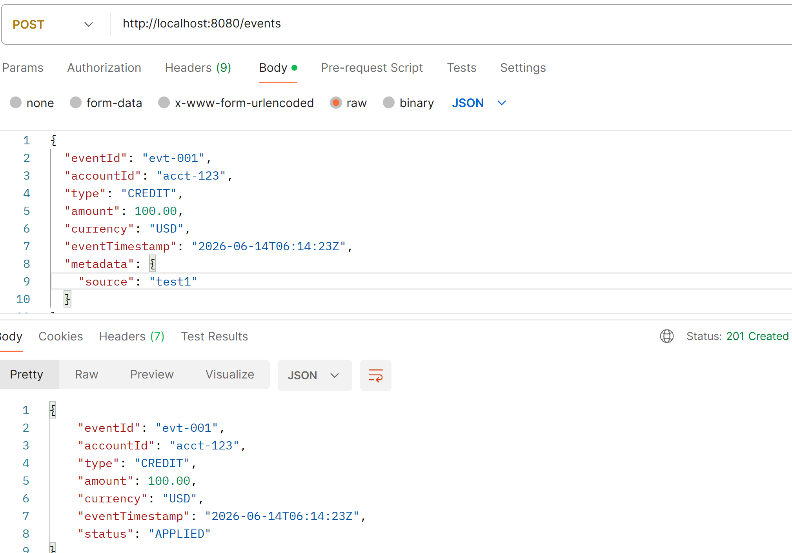

### 1.2 POST /events with duplicate `eventId`
- URL: `POST http://localhost:8080/events`
- Reuse the same `eventId` from a previous request
- Expected result:
  - HTTP 200 OK
  - no second call to Account Service
  - duplicate event detection logged
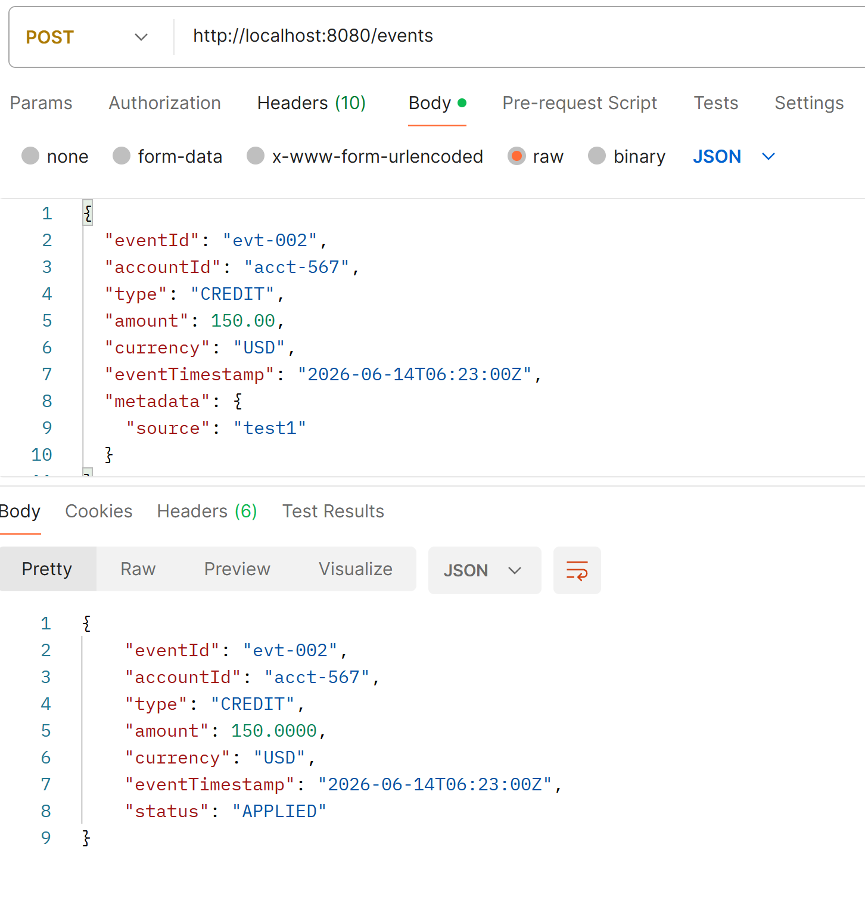
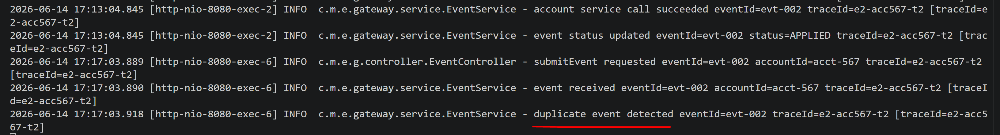

### 1.3 POST /events with invalid payload
- URL: `POST http://localhost:8080/events`
- Example invalid request body:
```json
{
  "eventId": "evt-101",
  "accountId": "acct-100",
  "type": "INVALID",
  "amount": 100.00,
  "currency": "USD"
}
```
- Expected result:
  - HTTP 400 Bad Request
  - validation error for invalid `type` or missing `eventTimestamp`
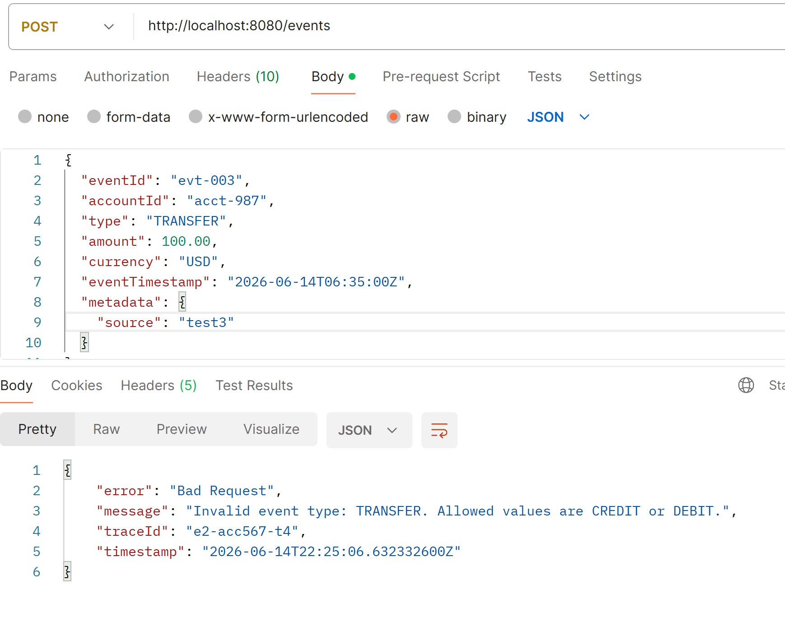
## 2. Event Retrieval
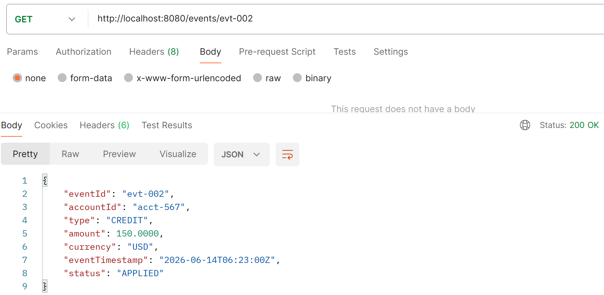
### 2.1 GET /events/{eventId}
- URL: `GET http://localhost:8080/events/evt-100`
- Expected result:
  - HTTP 200 OK when found
  - response contains `eventId`, `accountId`, `type`, `amount`, `currency`, `eventTimestamp`, `status`
  - HTTP 404 Not Found when not found
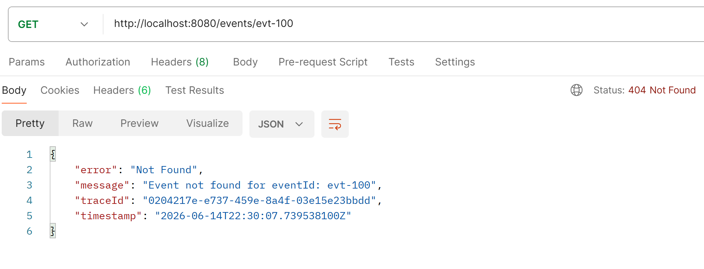
### 2.2 GET /events?account={accountId}
- URL: `GET http://localhost:8080/events?account=acct-100`
- Expected result:
  - HTTP 200 OK when events exist
  - returned events sorted by `eventTimestamp` ascending
  - empty list when account has no events
  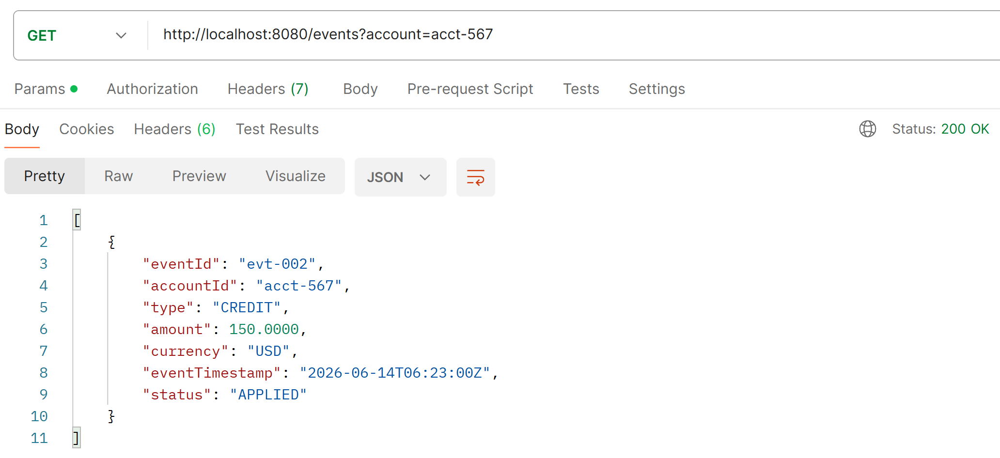
## 3. Account Service Integration

### 3.1 Account Service available
- Condition: Account Service responds normally at configured URL
- Expected result:
  - gateway persists event with status `APPLIED`
  - Account Service response flows through
  - overall request succeeds

### 3.2 Account Service unavailable
- Condition: downstream service is down or timed out
- Expected result:
  - event stored with status `FAILED`
  - gateway returns HTTP 503 Service Unavailable
  - retry and circuit breaker behavior observed
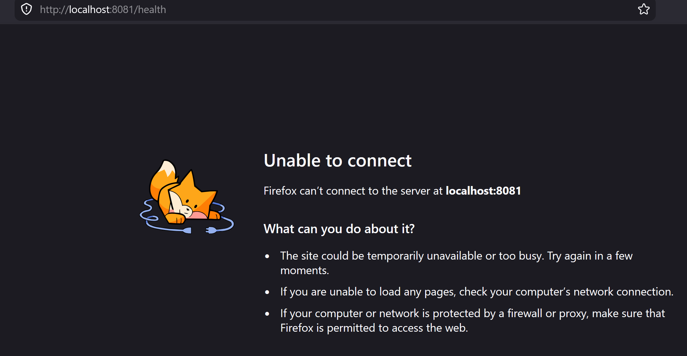
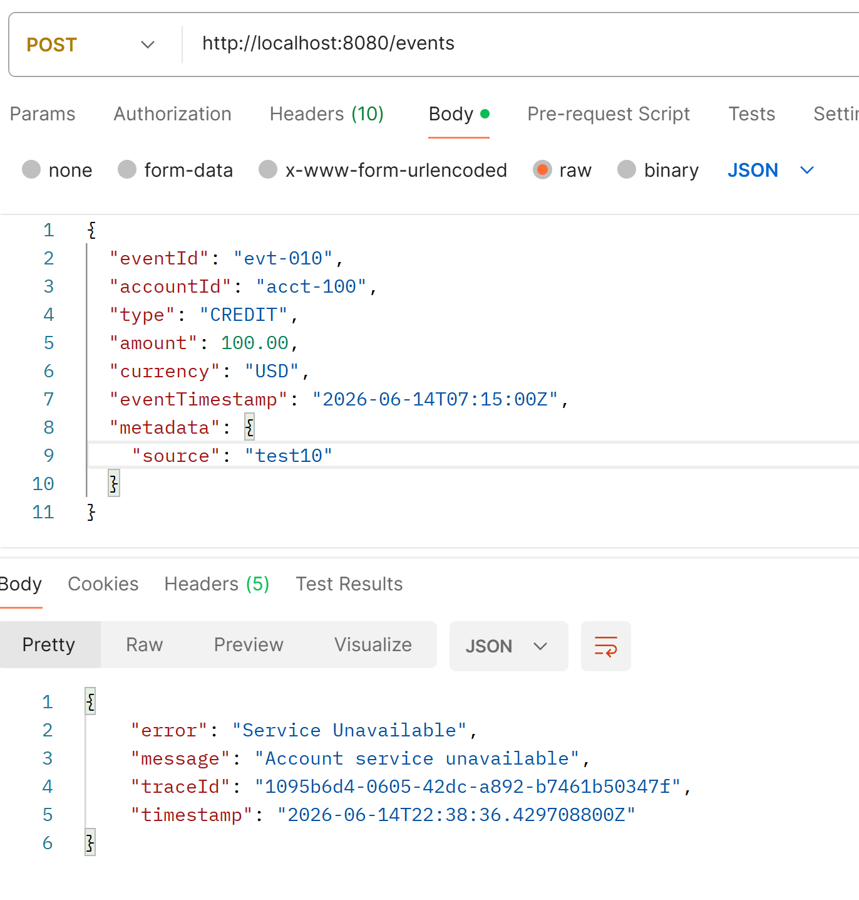
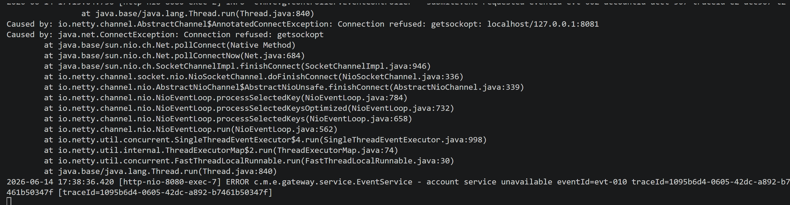
### 3.3 Account Service returns 4xx client error
- Condition: Account Service rejects request with 400/422
- Expected result:
  - gateway returns a corresponding client error or `400 Bad Request`
  - event failure is handled without retrying indefinitely

## 4. Health and Observability

### 4.1 GET /health
- URL: `GET http://localhost:8080/health`
- Expected result:
  - HTTP 200 OK when gateway is healthy
  - health payload includes current status
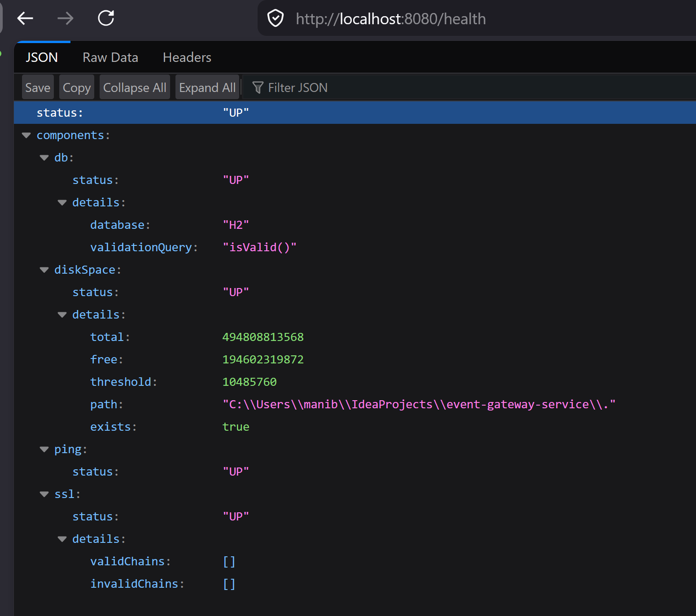

### 4.2 Actuator endpoints
- URL: `GET http://localhost:8080/actuator/health`
- URL: `GET http://localhost:8080/actuator/metrics`
- Expected result:
  - endpoint data is available
  - metrics endpoint returns gateway metrics

### 4.3 Logging and trace propagation
- Condition: request includes `X-Trace-Id: e2-acc567-t2`
- Expected result:
  - POST and GET requests log `eventId`, `accountId`, and `traceId`
  - outbound Account Service requests include `X-Trace-Id` header
Request and response
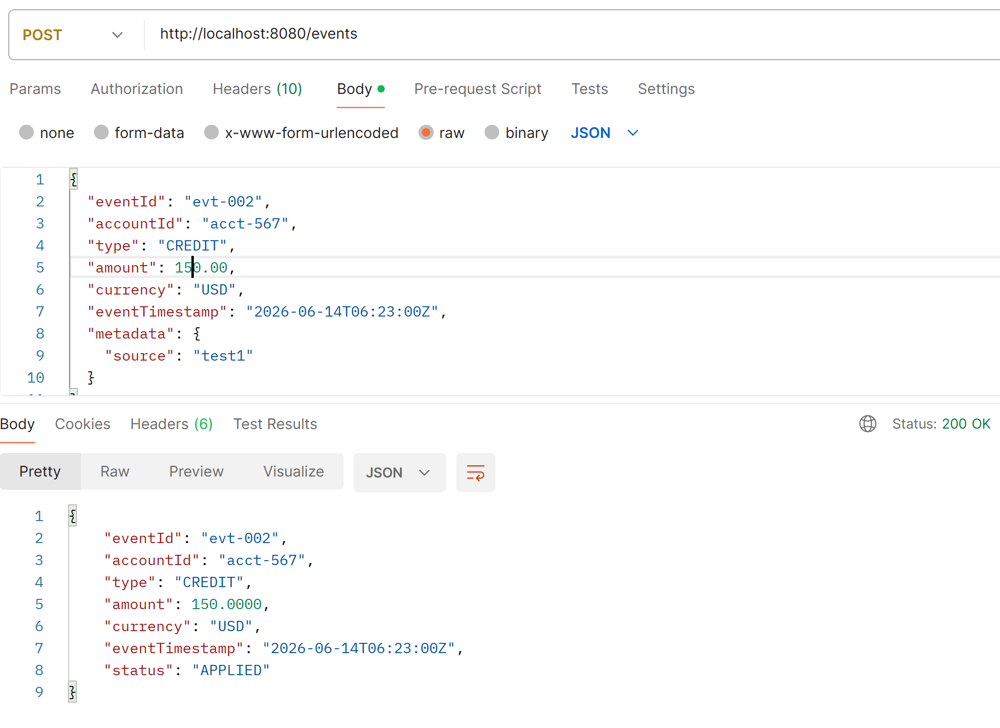
Event gateway Logs:
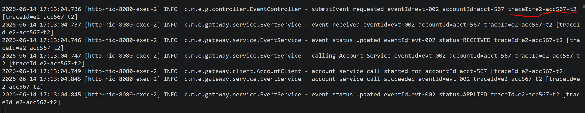
Account service log:
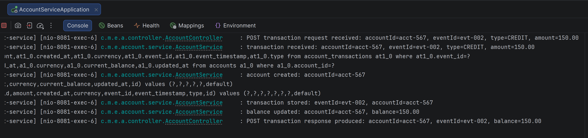
Trace ID passed from header and the response header
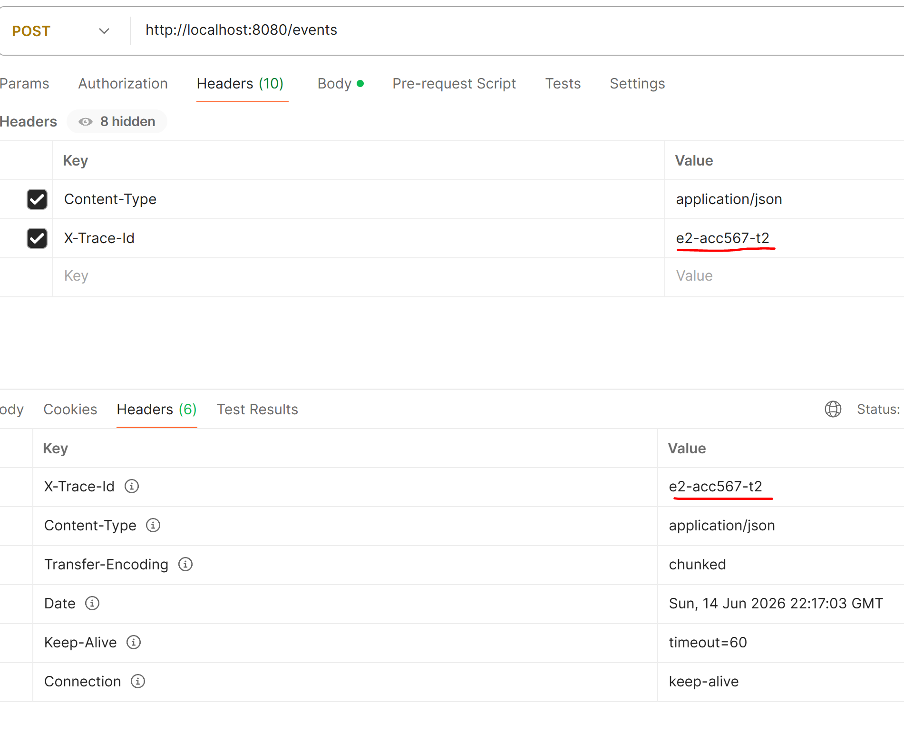
## 5. Resiliency and Error Handling

<!-- ### 5.1 Retry behavior
- Condition: transient network error from Account Service
- Expected result:
  - retry attempts occur up to configured limit
  - ingress request eventually succeeds or fails after retries -->

### 5.1 Circuit breaker behavior
- Condition: repeated downstream failures
- Expected result:
  - circuit opens after configured failure threshold
  - subsequent requests fail fast while circuit is open

#### Circuit Breaker Configuration
The gateway uses Resilience4j with the following settings (from `application.yaml`):
- **sliding-window-size**: 10 calls
- **minimum-number-of-calls**: 5 calls required before evaluating
- **failure-rate-threshold**: 50% failure rate triggers the circuit open
- **wait-duration-in-open-state**: 10 seconds (circuit remains open, then transitions to half-open)
- **permitted-number-of-calls-in-half-open-state**: 3 trial calls allowed in half-open state

#### How to Test Circuit Breaker Behavior

**Step 1: Stop or simulate Account Service failure**
- Stop the Account Service, or configure it to return 500/503 errors
- Alternatively, point `ACCOUNT_SERVICE_URL` to a non-existent host (e.g., `http://localhost:9999`)

**Step 2: Trigger failures**
- Send multiple POST requests to trigger Account Service calls:
```bash
for i in {1..6}; do
  curl -X POST http://localhost:8080/events \
    -H "Content-Type: application/json" \
    -d '{
      "eventId": "evt-cb-'$i'",
      "accountId": "acct-cb",
      "type": "CREDIT",
      "amount": 100.00,
      "currency": "USD",
      "eventTimestamp": "2026-06-14T12:00:00Z"
    }' \
    -w "\nHTTP Status: %{http_code}\n\n"
done
```

**Step 3: Observe circuit state**
- Monitor logs for circuit breaker state transitions
- Check metrics endpoint to verify circuit state:
```bash
curl http://localhost:8080/actuator/metrics/resilience4j.circuitbreaker.state
```
- Expected output when circuit opens:
```json
{
  "name": "resilience4j.circuitbreaker.state",
  "measurements": [
    {
      "statistic": "VALUE",
      "value": 2  // 2 = OPEN state
    }
  ]
}
```

**Step 4: Verify fast failure when circuit is open**
- After ~5 requests (with 50% failure rate threshold), the circuit should open
- Subsequent requests should fail immediately with `503 Service Unavailable` **without** waiting for Account Service timeout
- Check logs for "CircuitBreaker 'accountService' is OPEN" message

**Step 5: Wait for half-open transition**
- After 10 seconds (`wait-duration-in-open-state`), circuit transitions to half-open
- Send a new request to test recovery attempt
- If successful, circuit closes; if failed, circuit remains open

**Step 6: Verify recovery**
- Restart the Account Service or fix the endpoint
- Send new requests during half-open state
- Expect circuit to close after 3 successful calls (`permitted-number-of-calls-in-half-open-state`)

#### Testing Tools

- **curl**: Send manual HTTP requests
- **Postman**: Send requests with visual inspection
- **Spring Boot Actuator**: Monitor circuit state via `/actuator/metrics/`
- **Application logs**: Tail logs to observe state transitions and failures

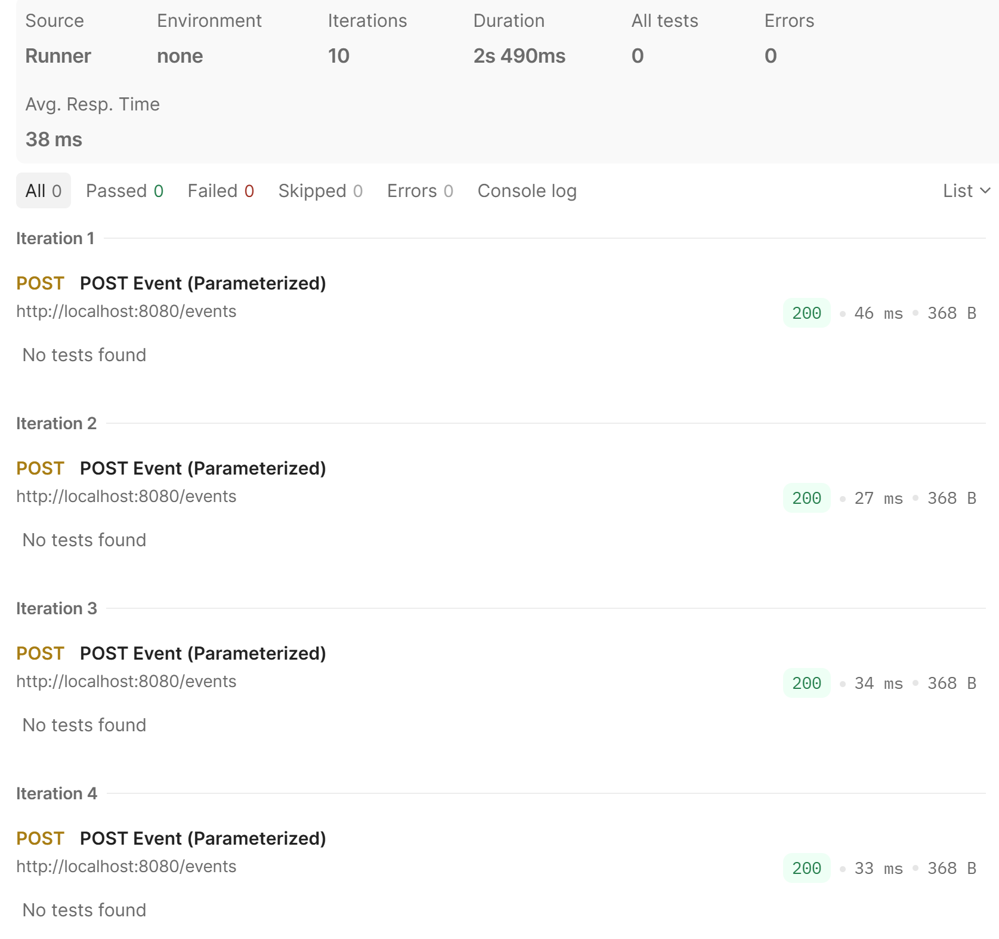
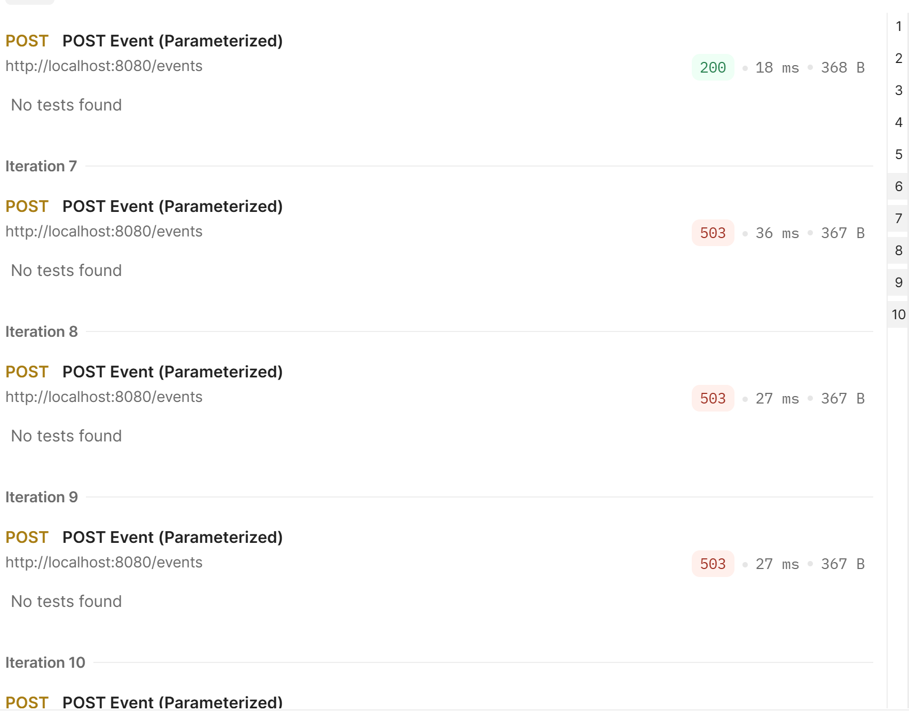
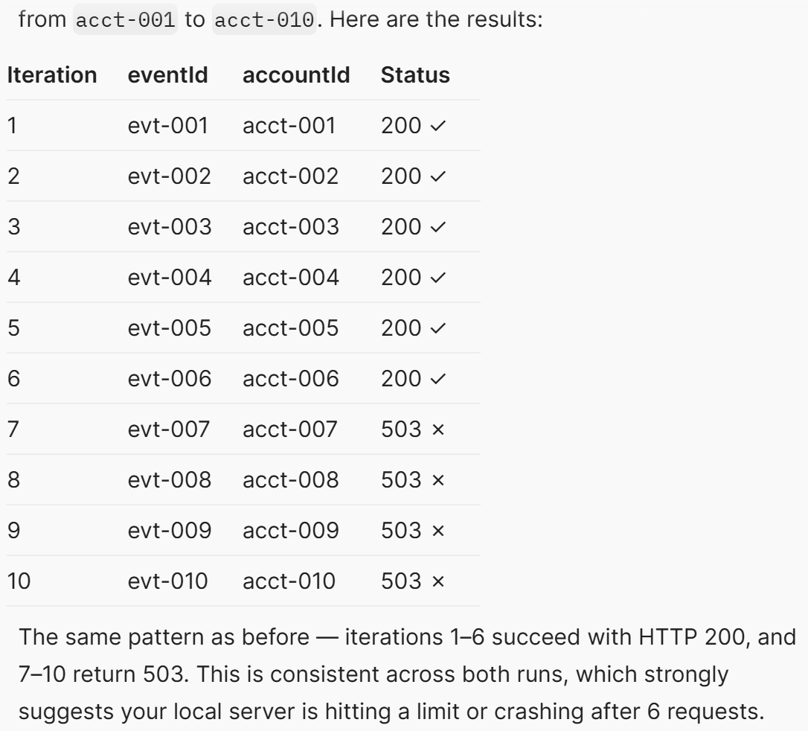

## 6. Database and Idempotency

### 6.1 Idempotent event handling
- Condition: repeated POST with same `eventId`
- Expected result:
  - duplicate detection prevents reprocessing
  - response returns existing event details


### 6.2 Event ordering
- Condition: multiple events for same account
- Expected result:
  - GET `/events?account=acct-100` returns events ordered by `eventTimestamp`
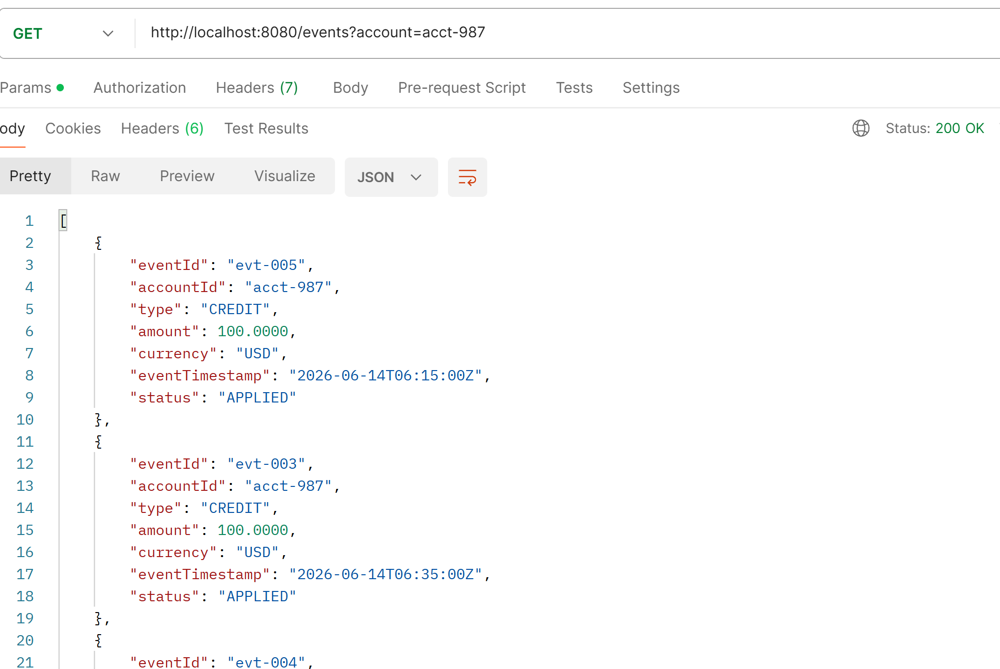
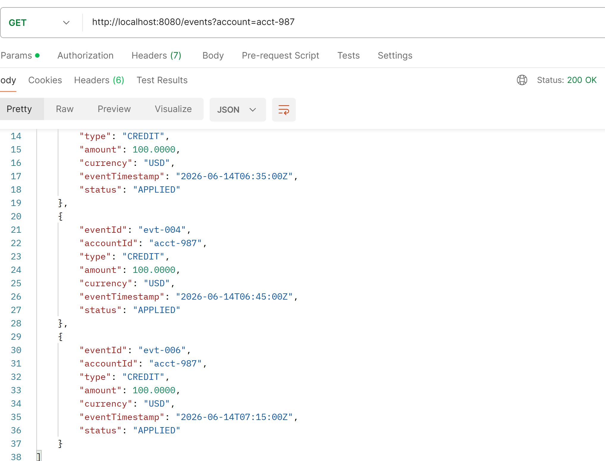
## Notes

- Use the sample URLs above against `http://localhost:8080`.
- Verify both happy-path and failure-path scenarios.
- Confirm event storage and retrieval remain functional if the Account Service is unreachable.
